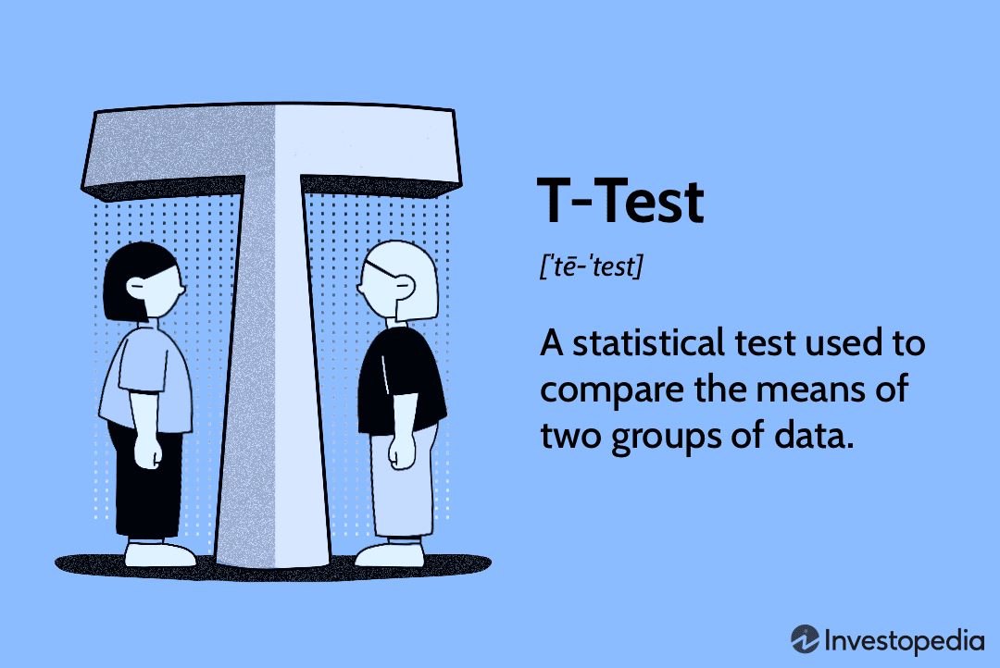
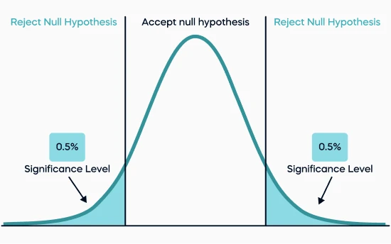
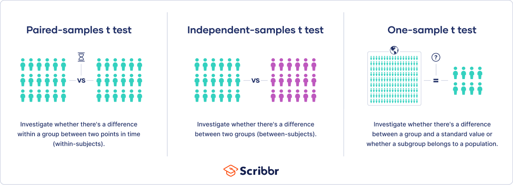
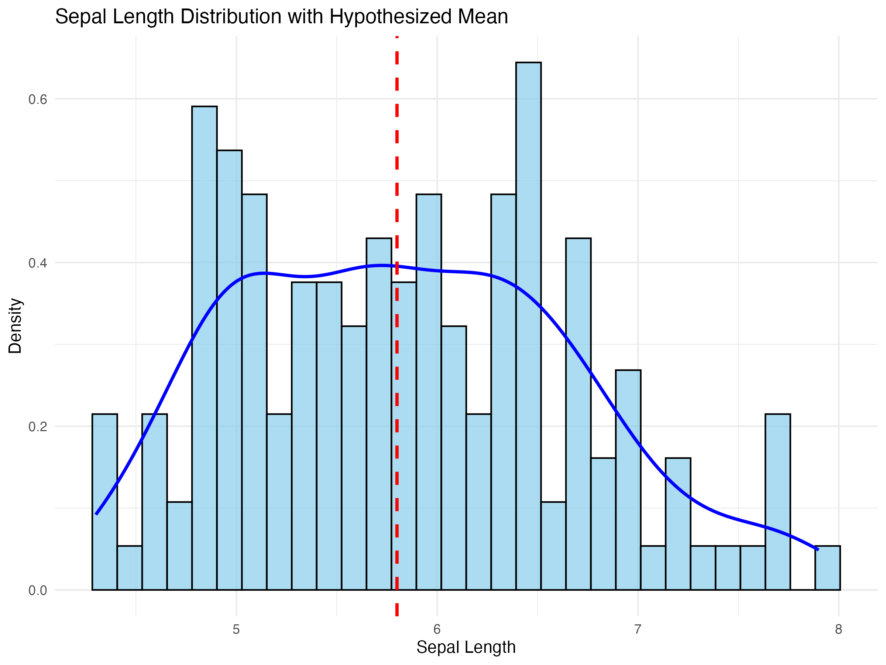
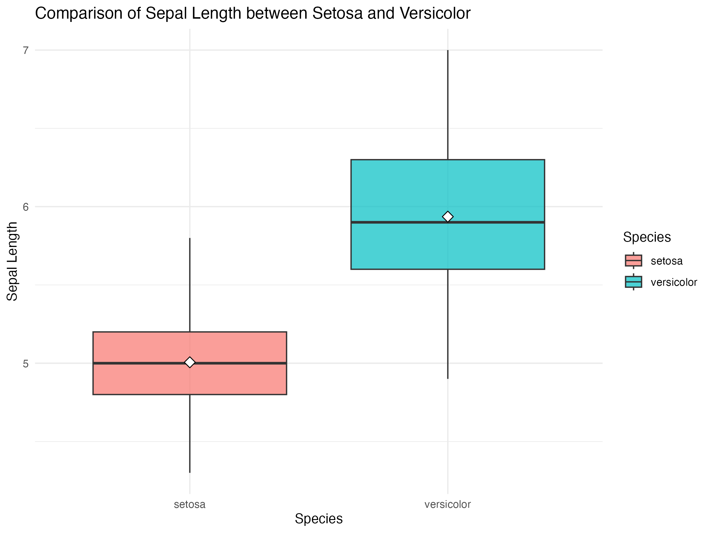

<center></center>

#### <a href="#sectiono"> 0. R set up</a>

#### <a href="#section1"> 1. What are T-test, and why is it important?</a>

-   Understand its statistical relevance.
-   Learn appropriate scenarios for its use.

#### <a href="#section2"> 2. Basics of Hypothesis Testing</a>

-   Understanding null and alternative hypotheses.
-   Explaining p-value and significance level.
-   Introducing types of errors (Type I and Type II).

#### <a href="#section3"> 3. T-test</a>

-   **3.1 One-sample t-test**: Test if a mean differs from a hypothetical value.
-   **3.2 Independent t-test**: Compare means between two independent groups.
-   **3.3 Paired t-test**: Compare means of paired data (e.g., repeated measures).

#### <a href="#section4"> 4. Visualizing Results</a>

-   One-Sample t-Test: Histogram with Hypothesized Mean

-   Two-sample t-Test: Boxplot

-   Two-sample T-test: Density plot

#### <a href="#section5"> 5. Summary and future study direction</a>

- Summary

- What's next?

This tutorial introduces the fundamental statistical tests: the **T-test**. You will learn its purposes, how to apply them, and how to interpret their results using R. These skills are crucial for analyzing data in various fields, including environmental and ecological sciences.

The link for this tutorial is <a href="https://eddatascienceees.github.io/tutorial-ChiantiRuan/" target="_blank">this GitHub link</a>. You can get all of the resources for this tutorial from <a href="https://github.com/EdDataScienceEES/tutorial-ChiantiRuan.git" target="_blank">this GitHub repository</a>. Clone and download the repo as a zip file, then unzip it.

---

## <a name="section0">0. R set up </a>

It’s completely okay if you’ve never used R before—you can walk through everything step by step with us! Everyone starts as a beginner, and we’re here to guide you through the process and make it as smooth as possible. Together, we’ll cover the basics and get you comfortable with using R in no time. A great resource to guide you through this process is the Coding Club tutorial <a href="https://ourcodingclub.github.io/tutorials/intro-to-r/" target="_blank">Getting Started with R and RStudio</a>. While you’re at it, take a look at their <a href="https://ourcodingclub.github.io/tutorials/troubleshooting/" target="_blank">Troubleshooting and How to Find Help</a> tutorial—it’s really helpful — and the <a href="https://ourcodingclub.github.io/tutorials/etiquette/index.html" target="_blank">Coding Etiquette guide<a/>, which offers excellent tips for navigating the coding community.

Now, let's get started.

First, open `RStudio`, create a new *script* by clicking on `File/New File/R Script`. A Script in R is a file where you can write and save code to run, edit, and reuse later. Name your script appropriately, so that it clearly reflects its purpose and makes it easy to identify later. It is always a good idea the write a header to your script with your name, data and purpose as shown below.

```r
# Title: Intro of T-test and Chi-squared test in R
# Script purpose: Use T-test and Chi-squared test to investigate questions on dataset iris
# Author - contact details
# Date
```

Next, set your working directory to the folder containing the unzipped files on your computer.

```r
# Set the working directory
setwd("your_filepath")
getwd()  # Run this to check where your working directory is
```

Then, load the required packages and dataset, installing them first if they are not already available.

``` r
# load packages
library(ggplot2)
library(reshape2)
library(dplyr)

# Load the iris dataset
data(iris)
head(iris)  # View the first few rows
summary(iris)  # Summary of the dataset
```

After having an idea on how to deal with R, let's now start to learn T-test. 

---

### <a name="section1">1. What is t-test, and why is it important? </a>

#### Understand its statistical relevance

A t test is a statistical test that is used to compare the means of two groups. It is often used in hypothesis testing to determine whether a process or treatment actually has an effect on the population of interest, or whether two groups are different from one another. For instance:

- "Do students in online classes score higher than those in traditional classes?"

- "Are the differences in exam scores between male and female students significant?"

These tests provide robust frameworks to evaluate hypotheses and are widely applied across various fields, including biology, psychology, and business analytics.

##### Assumptions:

The t test is a parametric test of difference, meaning that it makes the same assumptions about your data as other parametric tests. The t test assumes your data:

- Normal distribution
- Homogeneity of variance
- Interval or ratio level of measurement

Note that a t test can only be used when comparing the means of two groups (a.k.a. pairwise comparison). If you want to compare more than two groups, or if you want to do multiple pairwise comparisons, use an ANOVA test or a post-hoc test.


#### Learn appropriate scenarios for their use

t-tests are appropriate in the following scenarios:

1. **Numerical Data**: When the data is continuous (e.g., height, weight, or length measurements).

2. **Comparing Means**: When the goal is to compare the means of one or more groups.
   - **One-sample t-test**: Used to check if the sample mean differs from a known or hypothetical value.
   - **Two-sample t-test**: Used to compare the means of two independent groups (e.g., two species).
   - **Paired t-test**: Used to compare measurements from the same group under different conditions or at different times (e.g., before-and-after studies).

By understanding these scenarios, it becomes easier to select the appropriate test for the analysis, ensuring valid and interpretable results.

<center></center>

--- 


### <a name="section2">2. Basics of Hypothesis Testing</a>

#### Hypothesis Testing

Hypothesis testing is a basic idea in statistics that helps us decide if we have enough evidence to support a claim about a group or population. It has a few important parts:

**Null and Alternative Hypotheses**

- **Null Hypothesis (\(H_0\))**: This is like the default assumption, saying nothing special is happening. For example, "There’s no difference between two groups."

- **Alternative Hypothesis (\(H_a\))**: This is the claim we’re testing, suggesting something *is* happening, like "The two groups are different."

**p-value and Significance Level**

- The **p-value** tells us how likely it is to see our results (or something even more surprising) if the null hypothesis is true.

- The **significance level (\(\alpha\))** is a cutoff point we choose (often 0.05). If the p-value is smaller than \(\alpha\), it means the results are unlikely under the null hypothesis, so we reject it.

**tails of the distribution**

- For a **one-tailed test**, the p-value is calculated for results in one direction of interest (e.g., greater than or less than a certain value). The entire \(\alpha\) is concentrated in one tail of the distribution.

- For a **two-tailed test**, the p-value accounts for extreme results in both directions, and \(\alpha\) is split equally between the two tails (e.g., \(0.025\) in each tail for \(\alpha = 0.05\)).

<center></center>

**Type I and Type II Errors**

- **Type I Error**: This happens when we think something is happening (reject \(H_0\)) but actually, nothing is (false alarm).

- **Type II Error**: This happens when we don’t notice something is happening (fail to reject \(H_0\)) even though it is (missed signal).

Hypothesis testing is useful because it helps us figure out whether the patterns we see in data are real or just random chance.

This might seems a lot to understand. Don't worry, we will go through this together step by step in latter sections. 

Before we dive into the different cases of T-test, we need to first understand what dataset we are using. 

### **What is the `iris` Dataset?**
The `iris` dataset is a collection of flower measurements from three types of iris flowers: `setosa`, `versicolor`, and `virginica`. There are 150 rows in total (50 flowers of each species). The dataset has these columns:

- **Sepal.Length**: How long the sepal is (in cm).  
- **Sepal.Width**: How wide the sepal is (in cm).  
- **Petal.Length**: How long the petal is (in cm).  
- **Petal.Width**: How wide the petal is (in cm).  
- **Species**: Which species the flower belongs to (`setosa`, `versicolor`, or `virginica`).

<center></center>

---

### <a name="section3">3. T-test</a>

### T-test Formula

The formula for the **two-sample \(t\)-test** (a.k.a. the Student’s \(t\)-test) is shown below:

\[
t = \frac{\bar{x}_1 - \bar{x}_2}{\sqrt{s^2 \left( \frac{1}{n_1} + \frac{1}{n_2} \right)}}
\]

In this formula:

- \(t\) is the \(t\)-value.

- \(\bar{x}_1\) and \(\bar{x}_2\) are the means of the two groups being compared.

- \(s^2\) is the pooled standard error of the two groups.

- \(n_1\) and \(n_2\) are the number of observations in each group.

A **larger \(t\)-value** indicates that the difference between group means is greater than the pooled standard error, showing a more significant difference between the groups.

To determine significance:

- Compare your calculated \(t\)-value against a critical value chart.

- If the \(t\)-value exceeds the critical value (based on your significance level \(\alpha\) and degrees of freedom), you can reject the null hypothesis and conclude that the two groups are significantly different.


There are three types of t-test: **One-sample t-test**, **Two-sample t-test**, and **Paired t-test**. You might come up with a question: **which test should I use**? 

So, here is how you find a suitable t-test: 

- If the groups come from a single population (e.g., measuring before and after an experimental treatment), perform a paired t test. This is a within-subjects design.

- If the groups come from two different populations (e.g., two different species, or people from two separate cities), perform a two-sample t test (a.k.a. independent t test). This is a between-subjects design.

- If there is one group being compared against a standard value (e.g., comparing the acidity of a liquid to a neutral pH of 7), perform a one-sample t test.


<center></center>

Now, let's apply what we have learned into application! 


#### **3.1 One-sample t-test**
This tests if the mean of a single group is different from a specific value. 

**Hypotheses:**

- **Null Hypothesis (\(H_0\))**: The mean sepal length is equal to 5.8.

- **Alternative Hypothesis (\(H_a\))**: The mean sepal length is not equal to 5.8.

Let’s check if the average sepal length of all flowers in the `iris` dataset is significantly different from 5.8 (a hypothetical value).

```r
# Test if the mean Sepal.Length is significantly different from 5.8
t.test(iris$Sepal.Length, mu = 5.8)
```

The output shows that: 

<center></center>

Since hypothesis testing primarily relies on the p-value, we will focus on analyzing the p-value.

- **p-value**: \( p = 0.5226 \)  

  This is much greater than 0.05, so we *fail to reject* the null hypothesis.

Then, we get the **conclusion**: 

The average sepal length in the `iris` dataset is not significantly different from 5.8. Any small difference is likely due to random chance.

<center></center>

Does that build you some confidence? Now, let's look at the next test. 


#### **3.2 Two-sample t-test**

This test compares the averages of two separate groups to see if they’re different.

In our example, we could write our hypothesis as: 

**Hypotheses:**

- **Null Hypothesis (\(H_0\))**: The mean sepal lengths of `setosa` and `versicolor` are equal.

- **Alternative Hypothesis (\(H_a\))**: The mean sepal lengths of `setosa` and `versicolor` are not equal.

```r
# Filter the data for two species
setosa <- subset(iris, Species == "setosa")
versicolor <- subset(iris, Species == "versicolor")

# Perform an independent t-test
t.test(setosa$Sepal.Length, versicolor$Sepal.Length)
```
The output shows that: 

<center></center>

- **p-value**: \( p < 2.2e-16 \)  

  This is much smaller than 0.05, so we *reject* the null hypothesis. 

Then, we can conclude from our result that, the mean sepal length of `setosa` and `versicolor` are not equal. 

<center></center>

Now, let's learn one more method. 

#### **3.3 Paired t-test**

This test is used to compare two related sets of measurements, like "before and after" scenarios.

In our example, we could write our hypothesis as: 

**Hypotheses:**

- **Null Hypothesis (\(H_0\))**: The mean of `Sepal.Length` is equal to the mean of `Petal.Length` for `setosa`.  
  (Or, we could also say that there is no significant difference between the two measurements.)
  
- **Alternative Hypothesis (\(H_a\))**: The mean of `Sepal.Length` is not equal to the mean of `Petal.Length` for `setosa`.  
  (Or, we could also say that there is a significant difference between the two measurements.)

```r
# Compare Sepal.Length and Petal.Length within the same species ("setosa")
setosa_data <- subset(iris, Species == "setosa")
t.test(setosa_data$Sepal.Length, setosa_data$Petal.Length, paired = TRUE)
```
The output shows that: 

<center></center>

- **p-value**: \( p < 2.2e-16 \)  

  This is much smaller than 0.05, so we *reject* the null hypothesis. 
  
Therefore, we can conclude from our result that, the mean of `Sepal.Length` is not equal to the mean of `Petal.Length` for `setosa`. 

<center></center>

---

### <a name="section4">4. Visualizing Results</a>

To complement the t-test analysis, we’ll use visualisations to better understand the data and the relationships between groups. While the t-test provides numerical evidence for differences between means, visualising the data helps us grasp the distribution, variability, and potential outliers. In this section, we’ll use different plots to illustrate the results of both one-sample and independent t-tests in an accessible and intuitive way.

#### One-Sample t-Test: Histogram with Hypothesized Mean

**Why this plot?**

This plot helps us compare the distribution of `Sepal.Length` with the hypothesized mean ($mu = 5.8$) in a one-sample t-test. It also lets us visually assess whether the data looks approximately normal, which is an important assumption for the t-test.

**How should we create it?**

We use a histogram to show the distribution of `Sepal.Length` and overlay a density curve to highlight the shape of the data. A dashed red line marks the hypothesized mean so we can see how it compares to the data.
```r
ggplot(iris, aes(x = Sepal.Length)) +
  geom_histogram(aes(y = ..density..), bins = 30, fill = "skyblue", alpha = 0.7, color = "black") +
  geom_density(color = "blue", size = 1) +
  geom_vline(xintercept = 5.8, linetype = "dashed", color = "red", size = 1) +
  labs(title = "Sepal Length Distribution with Hypothesized Mean",
       x = "Sepal Length",
       y = "Density") +
  theme_minimal()
```
The output is shown as: 

<center></center>

**What can we see?**

The distribution of `Sepal.Length` appears roughly normal, with no major skewness or irregularities. This suggests that the data does not violate the assumption of normality, which supports the use of the t-test. The dashed line at ($mu = 5.8$) lies close to the center of the distribution, hinting that the mean of `Sepal.Length` might not be significantly different from the hypothesized mean. However, the t-test confirms this numerically.


#### Two-sample t-Test: Boxplot

**Why this plot?**

We’re comparing `Sepal.Length` between two species: `setosa` and `versicolor`. A boxplot is great for this because it shows the range, median, and variability of each group. It’s a clear way to check if the groups are different.

**How should we make it?**

We will filter the data for `setosa` and `versicolor`. Then, we can create a boxplot and added dots for group means (those black points).

```r
ggplot(iris %>% filter(Species %in% c("setosa", "versicolor")), 
       aes(x = Species, y = Sepal.Length, fill = Species)) +
  geom_boxplot(alpha = 0.7) +
  stat_summary(fun = mean, geom = "point", shape = 23, size = 3, color = "black", fill = "white") +
  theme_minimal() +
  labs(title = "Comparison of Sepal Length between Setosa and Versicolor",
       x = "Species",
       y = "Sepal Length")
```

**What can we see?**

If the boxes for `setosa` and `versicolor` overlap a lot, their means might not be very different. If they are clearly separated, it suggests the groups have different averages. The graph clearly shows the latter, with a significant difference between mean of `setosa` and `versicolor`. This aligns with our outcome for two sample test. 

<center></center>


#### Two-sample T-test: Density plot

**Why this plot?**

The density plot shows the distribution shape of `Sepal.Length` for `setosa` and `versicolor`. It’s helpful to see if the groups are really different or if their ranges overlap a lot.

**How should we make it?**

We will first filter the data for the two species. We will then plot the density of `Sepal.Length` for each group and added dashed lines to mark the group means.

```r
ggplot(iris %>% filter(Species %in% c("setosa", "versicolor")), 
       aes(x = Sepal.Length, fill = Species)) +
  geom_density(alpha = 0.5) +
  geom_vline(data = iris %>% filter(Species %in% c("setosa", "versicolor")) %>%
               group_by(Species) %>%
               summarise(mean = mean(Sepal.Length)),
             aes(xintercept = mean, color = Species),
             linetype = "dashed", size = 1) +
  theme_minimal() +
  labs(title = "Density Plot of Sepal Length by Species",
       x = "Sepal Length",
       y = "Density")
```

**What can we see?**

This density plot compares the `Sepal.Length` distributions for `setosa` (red) and `versicolor` (blue). The dashed lines represent the means of each group, showing that `versicolor` has a higher mean compared to `setosa`. The distinct peaks and minimal overlap between the curves suggest a noticeable difference in `Sepal.Length` between the two species, with `setosa` having more concentrated values around 5, while `versicolor` shows a broader distribution around 6. This visualization supports the use of a t-test to assess the statistical significance of the observed mean difference.

If you are interested in exploring more data visualisation methods, or creating a more beautiful graph, you could find helpful tutorials here <a href="https://ourcodingclub.github.io/tutorials/datavis/" target="_blank">Useful links</a>.


---

### <a name="section5">5. Summary and future study direction</a>

#### Summary

Throughout this tutorial, we explored the fundamentals of the **t-test**, its types, and their respective applications in hypothesis testing. By applying the t-test in R, we not only validated statistical differences but also enhanced our interpretation with visualizations. The examples from the `iris` dataset demonstrate how to seamlessly integrate statistical tests into real-world data analysis workflows.

#### What’s Next?

To further solidify your understanding:
- Experiment with other datasets to practice t-tests.
- Explore more complex statistical methods like **ANOVA** for comparing multiple groups or post-hoc tests for pairwise comparisons.
- Dive deeper into R's data visualization capabilities to create compelling and informative plots.

Remember, t-tests are a cornerstone of statistical analysis, and mastering them lays the foundation for more advanced techniques. If you have any questions or feedback about this tutorial, don’t hesitate to reach out to us.

Happy coding and analyzing!


---

Check out our <a href="https://ourcodingclub.github.io/links/" target="_blank">Useful links</a> page where you can find loads of guides and cheatsheets.

If you have any questions about completing this tutorial, please contact us on [ourcodingclub\@gmail.com](mailto:ourcodingclub@gmail.com){.email}

<a href="INSERT_SURVEY_LINK" target="_blank">We would love to hear your feedback on the tutorial, whether you did it in the classroom or online!</a>

<ul class="social-icons">

<li>

<h3><a href="https://twitter.com/our_codingclub" target="_blank">Follow our coding adventures on Twitter! <i class="fa fa-twitter"></i></a></h3>

</li>

</ul>
